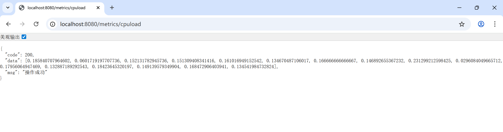
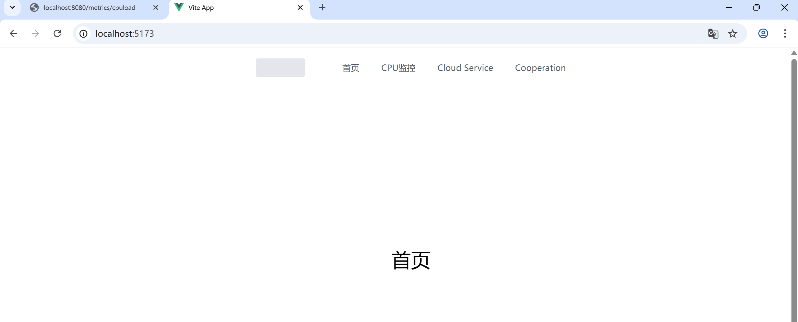
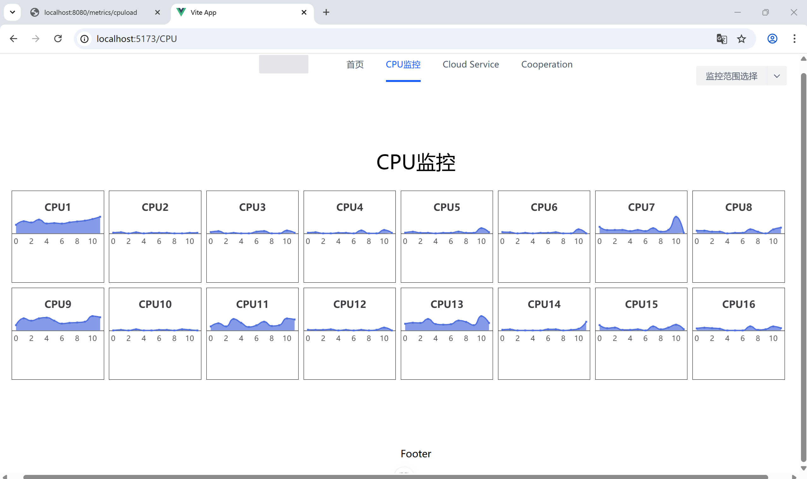
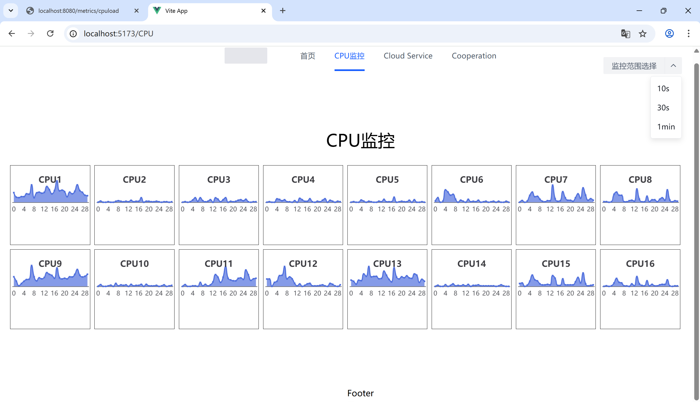

# SpringBoot-全栈监控系统
> java+OSHI+vue+echarts

## 📋 项目简介
本项目是设计一个SpringBoot的全栈监控系统，用于实时监控CPU指标。

## 🛠️ 技术栈

| 技术 | 版本 | 说明 |
|------|------|------|
| Java | 17 | 运行环境 |
| Spring Boot | 4.0.1 | Web应用框架 |
| OSHI | 6.6.5 | 第三方库 |
| Vue3 | Latest | 前端 |
| Echarts | Latest | 画图 |

## 📁 项目结构
```text
oshi-app/
├── src/          
│   └── main/
|       └── java/
|           └── com/baojingyi/oshi/   # 后端
│               ├── common/
|               |   └── R.java
│               ├── controller/
|               |   └── CpuLoadRestController.java
|               └── service/
|                   └── CpuLoadMetricsService.java
├── pom.xml    
├── frontend-app\  # 前端
|   └── src/
|       ├── api/
|       │   └── cpuLoadApi.js
|       ├── assets/
|       ├── components/
|       ├── http/
|       │   └── index.js
|       ├── router/
|       │   └── index.js
|       ├── stores/
|       ├── views/
|       │   ├── CPU/
|       │   │   └── CPULoad.vue
|       │   ├── dropdown-button.vue
|       │   ├── HomeView.vue
|       │   └── Menu.vue
|       ├── App.vue
|       └── main.js         
└── docs/                
    └── images/   # 截图
        ├── metrics.png
        ├── 首页.png
        ├── cpuload-10.png
        └── cpuload-30.png
```

## 🚀 快速开始
### 🎯后端
```java
# R.java
package com.baojingyi.oshi.common;
import lombok.Data;
@Data
public class R {
    private Integer code;
    private String msg;
    private Object data;

    public R(Integer code, String msg){
        this.code = code;
        this.msg = msg;
    }

    public R(Integer code, String msg, Object data){
        this.code = code;
        this.msg = msg;
        this.data = data;
    }
    public static R ok(Object data){
        return new R(200,"操作成功",data);
    }

    public static R ok(){
        return new R(200,"操作成功",null);
    }

    public static R error(String msg){
        return new R(500,msg,null);
    }

    public static R error(){
        return new R(500,"操作失败",null);
    }

    public static R error(Integer code,String msg){
        return new R(code,msg,null);
    }
}
```
```java
# CpuLoadRestController.java
package com.baojingyi.oshi.controller;
import com.baojingyi.oshi.common.R;
import com.baojingyi.oshi.service.CpuLoadMetricsService;
import org.springframework.beans.factory.annotation.Autowired;
import org.springframework.web.bind.annotation.CrossOrigin;
import org.springframework.web.bind.annotation.GetMapping;
import org.springframework.web.bind.annotation.RequestMapping;
import org.springframework.web.bind.annotation.RestController;

@CrossOrigin
@RequestMapping ("/metrics")
@RestController
public class CpuLoadRestController {

    @Autowired
    CpuLoadMetricsService cpuLoadMetricsService;

    @GetMapping ("/cpuload")
    public R getCpuLoad(){
        double[] cpuLoad = cpuLoadMetricsService.getCpuLoad();
        return R.ok(cpuLoad);

    }
}
```

```java
# CpuLoadMetricsService.java
package com.baojingyi.oshi.service;
import org.springframework.stereotype.Service;
import oshi.SystemInfo;
import oshi.hardware.CentralProcessor;
import oshi.hardware.HardwareAbstractionLayer;

@Service
public class CpuLoadMetricsService {
    //OSHI提供的获取所有数据的入口
    SystemInfo si = new SystemInfo();
    public double[] getCpuLoad() {
        HardwareAbstractionLayer hardware = si.getHardware();
        CentralProcessor processor = hardware.getProcessor();
        double[] cpuLoad = processor.getProcessorCpuLoad(1000);
        return cpuLoad;
    }
}
```
### 📊 监控效果
访问`http://localhost:8080/metrics/cpuload`，获取到自己电脑的cpu使用率


### 🎯前端
1.创建项目脚手架：`npm create vite`  <br>
2.安装依赖：`npm install`  <br>
3.获取依赖：`npm install axios echarts @arco-design/web-vue`  <br>
arco-design-vue：ui框架  <br>
axios:发请求  <br>
echarts:画图  <br>
4.启动项目：`npm run dev`  <br>

### 📊 监控效果
访问`http://localhost:5173/`


点击上方菜单栏中'CPU监控'，跳转`http://localhost:5173/CPU`


右上角可选择监控的范围，例如点击30min,则显示30个数据


